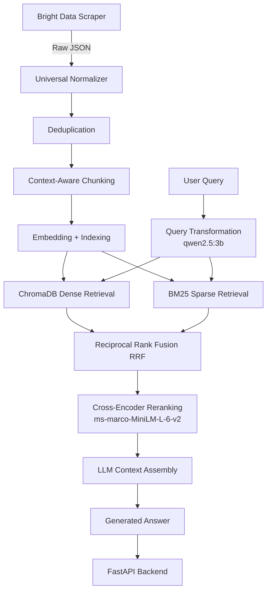

# RAG Pipeline

A production-oriented Retrieval-Augmented Generation pipeline for intelligent document ingestion, hybrid retrieval, reranking, and LLM-powered question answering.


--------------------------------------------------

## 2. PROJECT OVERVIEW

This project is a high-performance Retrieval-Augmented Generation (RAG) architecture pipeline designed to ingest raw scraped JSON data, process it intelligently, and serve high-accuracy LLM answers via a REST API. 

The initial data ingestion relies on web scrapers built using Bright Data's AI tools, which scrape and extract structured data. The RAG pipeline is entirely decoupled from the scraper, focusing on transforming the raw structured data into a highly queryable hybrid vector and keyword index.

By combining dense semantic search (ChromaDB) with sparse keyword retrieval (BM25), reciprocal rank fusion (RRF), query transformation via local LLMs, and cross-encoder reranking, this implementation guarantees high context precision and reduces hallucinations in the final generated answer.

--------------------------------------------------

## 3. ARCHITECTURE



### Key Components

*   **Universal Normalizer:** A schema-agnostic ingestion engine.
*   **Deduplication:** An O(n) MinHash + Exact Hash LSH deduplication pipeline.
*   **Context-Aware Chunking:** Intelligently splits documents.
*   **Hybrid Search Engine:** Dense and sparse indices queried simultaneously.
*   **Query Transformation:** Uses a local LLM to generate alternative semantic queries.
*   **Reranking:** Cross-encoder model scores candidate relevance.

--------------------------------------------------

## 4. END-TO-END RAG PIPELINE

When a user submits a query to the API, it travels through the following sequence:

1.  **Query Transformation:** The user's query is passed to a local LLM (`qwen2.5:3b`) to generate alternative semantic variations of the query, maximizing retrieval surface area.
2.  **Dense + Sparse Retrieval:** The original and transformed queries are embedded using `all-MiniLM-L6-v2` and searched against ChromaDB (Dense), while simultaneously being searched against a BM25 index (Sparse).
3.  **RRF Fusion:** The dense and sparse results are mathematically fused using Reciprocal Rank Fusion to balance semantic relevance and exact keyword matches.
4.  **Cross-Encoder Reranking:** The fused candidates are re-scored using `cross-encoder/ms-marco-MiniLM-L-6-v2` to ensure the absolute best chunks make it to the prompt.
5.  **Context Assembly & Generation:** The top reranked chunks are formatted into a context window and passed to the final generation LLM to produce an accurate answer.

--------------------------------------------------

## 5. KEY FEATURES

*   **Universal Normalization:** Uses fuzzy-matching to classify fields from the scraper's JSON output (e.g., matching `desc` or `summary` to `description`) into standardized `NormalizedDocument` objects.
*   **High-Speed Deduplicator:** Uses O(n) MinHash + Exact Hash LSH to identify and remove exact and near-duplicate documents before they enter the vector store.
*   **Context-Aware Chunking:** Splits documents into LLM-friendly chunks while respecting boundaries of code blocks, parameter lists, and prose.
*   **Dense Retrieval:** Uses `all-MiniLM-L6-v2` embeddings stored in ChromaDB.
*   **Sparse Retrieval:** Uses a BM25 keyword index to capture exact terminology.
*   **Reciprocal Rank Fusion (RRF):** Mathematically combines ranks from Dense and Sparse retrieval.
*   **Query Transformation:** Utilizes local LLM inference to expand queries.
*   **Cross-Encoder Reranking:** Applies deep semantic comparison between the query and retrieved candidates.
*   **API Serving:** Built on FastAPI, utilizing a shared `SearchEngine` singleton to prevent memory leaks and handle concurrent requests efficiently.

--------------------------------------------------

## 6. TECH STACK

| Component | Technology | Purpose |
| :--- | :--- | :--- |
| **Language** | Python | Core implementation |
| **API** | FastAPI | REST API Framework |
| **Server** | Uvicorn | ASGI server |
| **Vector Store** | ChromaDB | Dense retrieval database |
| **Embeddings** | all-MiniLM-L6-v2 | Semantic embeddings |
| **Sparse Retrieval** | BM25 | Keyword retrieval |
| **Query Transformation**| Ollama / qwen2.5:3b | Query expansion |
| **Reranking** | ms-marco-MiniLM-L-6-v2 | Candidate reranking |

--------------------------------------------------

## 7. PROJECT STRUCTURE

```text
project/
├── rag/
│   ├── chunking/          # Context-aware text splitters
│   ├── config/            # Settings and Pydantic configuration
│   ├── models/            # Data models and structures
│   ├── pipeline/          # Normalizer and deduplicator
│   ├── retrieval/         # Query transform, fusion, and reranking
│   ├── search/            # Vector store, BM25, and embeddings
│   ├── serving/           # FastAPI application and schemas
│   ├── storage/           # SQLite store for raw document metadata
│   └── utils/             # Helper utilities
├── ingest.py              # CLI entry point for data ingestion
└── requirements.txt       # Project dependencies
```

--------------------------------------------------

## 8. SYSTEM REQUIREMENTS

*   **Python:** 3.9+
*   **RAM:** Minimum 8GB (16GB recommended to hold embeddings and models in memory)
*   **Local LLM Runner:** [Ollama](https://ollama.com/) running locally for query transformation.

--------------------------------------------------

## 9. INSTALLATION

Clone the repository and set up your Python environment:

```bash
# Create and activate a virtual environment
python -m venv venv

# Linux/macOS
source venv/bin/activate

# Windows
venv\Scripts\activate

# Install dependencies
pip install -r requirements.txt
```

--------------------------------------------------

## 10. LOCAL LLM / OLLAMA SETUP

This project uses Ollama to serve a local LLM for Query Transformation.

1. Install [Ollama](https://ollama.com/).
2. Pull the required model:

```bash
ollama pull qwen2.5:3b
```

Ensure Ollama is running (`ollama list`) before starting the API or ingestion pipeline if query transformation is enabled.

--------------------------------------------------

## 11. DATA INGESTION

Before running the API, you must ingest your scraped JSON data. The `ingest.py` script runs the full pipeline: Normalize → Deduplicate → Store → Chunk → Embed → Build Vector & BM25 indexes.

```bash
python ingest.py --input "phase3_output (2).json"
```

To force a full rebuild of the vector and BM25 indexes:

```bash
python ingest.py --input "phase3_output (2).json" --force-rebuild
```

--------------------------------------------------

## 12. RUNNING THE API

Start the FastAPI backend server using Uvicorn. The application uses a factory pattern and relies on a singleton search engine loaded at startup.

```bash
python -m uvicorn rag.serving.app:create_app --factory --host 127.0.0.1 --port 8000
```

--------------------------------------------------

## 13. API DOCUMENTATION

### Query Endpoint

`POST /api/v1/query`

Performs an end-to-end RAG query using the ingested data.

**Request Headers:**
`Content-Type: application/json`

**Request Body:**

```json
{
  "question": "How do I use sklearn config_context?",
  "top_k": 3,
  "filter_content_type": "api_reference",
  "use_reranking": true
}
```

| Parameter | Type | Required | Description |
| :--- | :--- | :--- | :--- |
| `question` | string | Yes | The user's question |
| `top_k` | integer | No | Number of results to return (default: 5) |
| `filter_content_type`| string | No | Filter by content type (e.g. 'tutorial', 'api_reference') |
| `filter_doc_id` | string | No | Filter by specific document ID |
| `use_reranking` | boolean| No | Apply cross-encoder re-ranking (default: True) |

**Response Example:**

```json
{
  "answer": "The purpose of sklearn.config_context is...",
  "sources": [
    {
      "chunk_id": "9bf961cfdf1ea8d1",
      "heading": "sklearn.config_context > Description",
      "url": "https://scikit-learn.org/stable/modules/...",
      "score": 7.338,
      "content_type": "prose",
      "source": "vector",
      "metadata": { ... }
    }
  ],
  "citations": [],
  "confidence": "high",
  "retrieval_time_ms": 1619.3,
  "generation_time_ms": 7555.6,
  "total_time_ms": 9174.9,
  "cached": false,
  "llm_model": "qwen2.5:3b",
  "transform_used": "MultiQueryTransformer",
  "reranker_used": "cross-encoder/ms-marco-MiniLM-L-6-v2"
}
```

--------------------------------------------------

## 14. LIMITATIONS

*   **Local LLM Dependency:** Query transformations and final generations are bottlenecked by local GPU/CPU inference speeds.
*   **Static Indexing:** The current pipeline requires running the ingestion script for updates; realtime incremental updates to Chroma/BM25 are not yet fully integrated.
*   **Lack of Authentication:** The API currently runs without API keys or rate limiting, suitable for internal or local deployment only.

--------------------------------------------------

## 15. ROADMAP / FUTURE IMPROVEMENTS

*   **Streaming Responses:** Implement WebSockets or SSE in FastAPI for token-by-token generation streaming.
*   **Semantic Caching:** Add a Redis layer to cache frequent semantic queries and return results instantly.
*   **Automated Evaluation:** Integrate RAGAS to programmatically score context precision, recall, and answer faithfulness.
*   **API Authentication:** Add API key validation and rate limiting for public deployment.
*   **Distributed Vector Storage:** Migrate from local ChromaDB to a managed/distributed vector store for massive scale.

