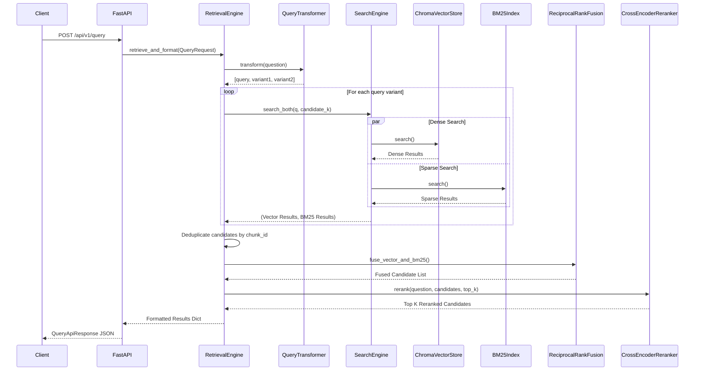

# API Reference

The primary backend interface for **doc//rag** is a FastAPI REST API defined in `rag/serving/app.py`.

## Request Lifecycle (POST `/api/v1/query`)

The following sequence diagram traces the actual call flow through the major components:



## `POST /api/v1/query`

Performs an end-to-end RAG query.

**Headers:**
`Content-Type: application/json`

**Request Schema (`QueryApiRequest`):**

| Parameter | Type | Required | Default | Description |
| :--- | :--- | :--- | :--- | :--- |
| `question` | string | **Yes** | - | The user's query |
| `top_k` | integer | No | 5 | Number of results to return |
| `filter_content_type` | string | No | null | Post-retrieval filter for chunk/doc type |
| `filter_doc_id` | string | No | null | Filter to restrict search to a specific document |
| `use_query_transform` | boolean | No | true | Whether to use the LLM to generate semantic query variants |
| `use_reranking` | boolean | No | true | Whether to apply the cross-encoder re-ranking pass |

**Example Request:**
```json
{
  "question": "How do I use sklearn config_context?",
  "top_k": 3,
  "filter_content_type": "api_reference",
  "use_query_transform": true,
  "use_reranking": true
}
```

**Response Schema (`QueryApiResponse`):**

| Field | Type | Description |
| :--- | :--- | :--- |
| `answer` | string | The final LLM-generated response. |
| `sources` | list[dict] | The retrieved chunk metadata. |
| `citations` | list[dict] | Extracted source citations. |
| `confidence` | string | System confidence score/rating. |
| `retrieval_time_ms` | float | Time spent in `RetrievalEngine`. |
| `generation_time_ms`| float | Time spent in LLM generation. |
| `total_time_ms` | float | Total request latency. |
| `cached` | boolean | Whether the result hit the cache. |
| `llm_model` | string | The generation model used. |
| `transform_used` | string | The query transformer model used (if any). |
| `reranker_used` | string | The cross-encoder model used (if any). |

**Example Response:**
```json
{
  "answer": "The purpose of sklearn.config_context is...",
  "sources": [
    {
      "chunk_id": "9bf961cfdf1ea8d1",
      "heading": "sklearn.config_context > Description",
      "url": "https://scikit-learn.org/stable/modules/...html",
      "score": 7.338,
      "content_type": "prose",
      "source": "reranked"
    }
  ],
  "citations": [],
  "confidence": "high",
  "retrieval_time_ms": 1619.3,
  "generation_time_ms": 7555.6,
  "total_time_ms": 9174.9,
  "cached": false,
  "llm_model": "qwen2.5:3b",
  "transform_used": "MultiQueryTransformer",
  "reranker_used": "cross-encoder/ms-marco-MiniLM-L-6-v2"
}
```
