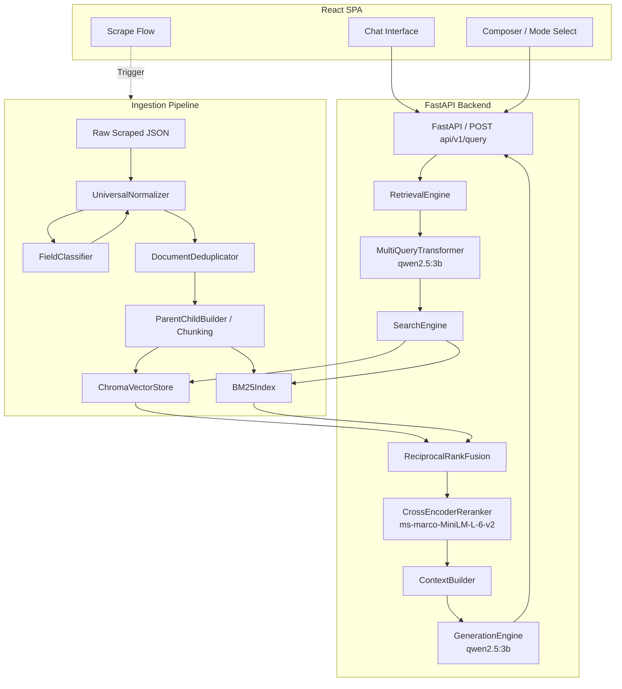

# Architecture Overview

**doc//rag** is designed as a decoupled, full-stack application connecting a modern React UI to a high-performance Python FastAPI RAG backend.

## 1. System Goals
This system is designed to seamlessly ingest heterogeneous, schema-less JSON scraped by Bright Data tools and convert it into a highly precise RAG knowledge base. The primary goals are:
- **Decoupling**: Strictly separating scraping logic from the RAG pipeline (`UniversalNormalizer`).
- **Precision**: Removing near-duplicates that skew retrieval (`DocumentDeduplicator`).
- **Context Preservation**: Preserving document structure via `ParentChildBuilder`.
- **High Recall & Precision**: Achieving high recall through Hybrid Search and query expansion, and high precision via Cross-Encoder reranking.

## 2. High-Level Architecture Diagram

## 3. Component Responsibilities
- **`UniversalNormalizer`**: Applies heuristic pattern matching (`FieldClassifier`) to map unknown JSON keys to known semantic blocks (e.g., `page_title` -> `title`).
- **`DocumentDeduplicator`**: Executes an O(n) pipeline (exact MD5 hash + MinHash/LSH) to purge duplicates.
- **`SearchEngine`**: Low-level interface interacting with `ChromaVectorStore` and `BM25Index`.
- **`RetrievalEngine`**: High-level orchestrator managing query transformation, routing queries to `SearchEngine`, applying `ReciprocalRankFusion`, and running `CrossEncoderReranker`.

## 4. Runtime Architecture
The FastAPI application (`rag/serving/app.py`) is initialized via a factory pattern. Crucially, the `SearchEngine` and `RetrievalEngine` are initialized at startup and injected as dependencies into the route handlers. This singleton behavior prevents reloading the embedding models (`SentenceTransformerEmbedder`), cross-encoders, and ChromaDB instances on every request, ensuring low latency.
